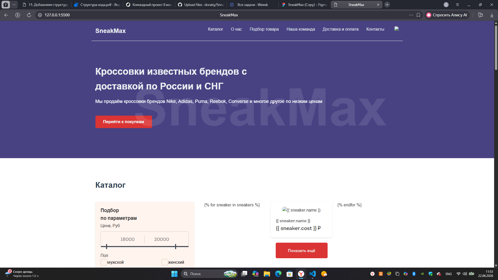
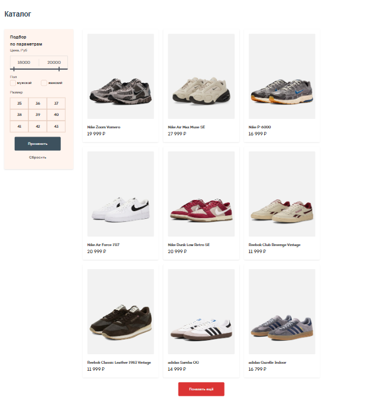
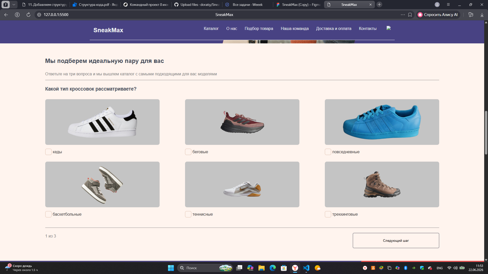
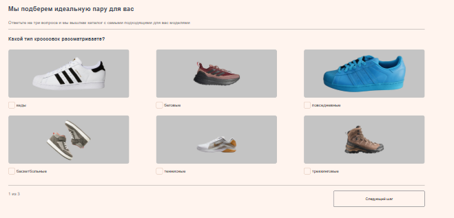
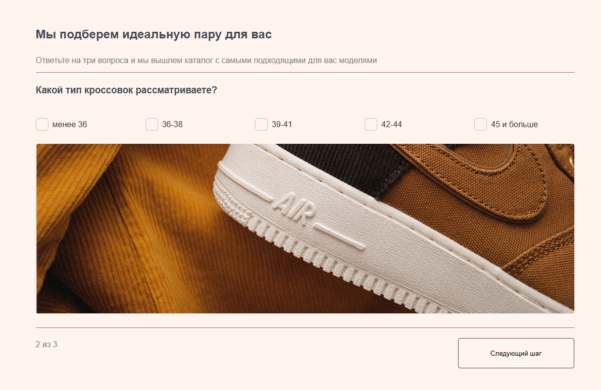
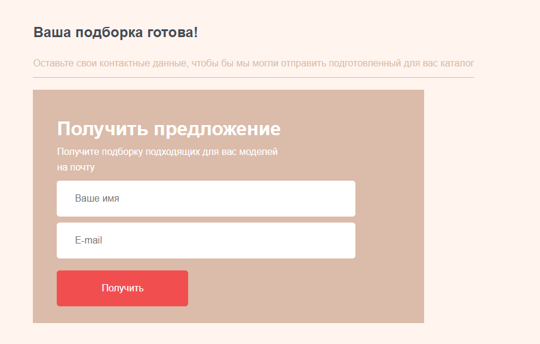
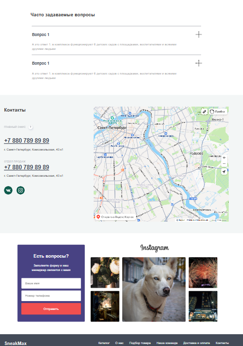

# SneakMax — интернет-магазин кроссовок

> 🔗 **Демо-версия:**

https://sneaker-store-wrxb.onrender.com/

**SneakMax** — это полноценный веб-проект, разработанный в рамках командной работы в школе Бюро20. Сайт представляет собой интернет-магазин с каталогом кроссовок, фильтрацией, интерактивным квизом для подбора обуви, формами обратной связи и загрузкой данных из Excel.

## Установка и запуск
Для запуска проекта нужна версия Python 3.11.9 или новее. 

Распакуйте архив с кодом в папку. Далее запустите командную строку и введите эту команду:
```
pip install -r requirements.txt 
```

Её нужно выполнить в директории с файлами проекта.

Если python-dotenv не установился автоматически, добавьте вручную:

```
pip install python-dotenv 
```

Далее нужен файл .env(Создайте его в корневой папке проекта). Его содержимое должно быть таким:

```

API_KEY="Ваш ключ от Resend"
 
```

⚠️ Важно: Для Gmail необходимо создать пароль приложения в настройках аккаунта Google (раздел «Безопасность» → «Пароли приложений»). Обычный пароль от почты не подойдёт.

Подготовьте Excel-файлы в корневой папке проекта:

 1. База Данных кроссовки.xlsx

 2. База Данных люди.xlsx

 3. База Данных инста.xlsx

Структура таблицы для кроссовок:

| Название | Стоимость | Путь до картинки |
|----------|------|-------------|
| Nike Air Max Muse SE| 27999 | ./static/images/Nike_Air_Max_Muse_SE.jpg|

Структура таблицы для команды:

| Имя | Должность | Путь до картинки |
|----------|------|-------------|
| Святослав Шумаев| Фронтенд-разработчик | ./static/images/team-1.jpg|

Структура таблицы для инсты:

| Путь до картинки |
|-------------|
|./static/images/team-1.jpg|

Изображения поместите в папку static/images/.

Дальше хостим сайт:
```
python app.py
```

Все готово! Чтобы увидеть страницу нужно перейти по [этому](http://127.0.0.1:5000) адресу.

## Технологии

### Фронтенд

HTML5, CSS3, JavaScript

Адаптивная верстка (Flexbox/Grid)

Аккордеон в FAQ, интерактивный квиз, динамическая фильтрация

### Бекенд

Python + Flask

Jinja2 — шаблонизация

Pandas — обработка Excel-данных

API Resend — отправка писем на почту


## Скриншоты:
















## Обратная связь

Письма отправляются через API Resend. Данные из формы обратной связи приходят на почту, указанную в .env. Шаблон письма формируется в коде в переменной email_content.

## Особенности реализации

Контент (картинки товаров, команды и Инстаграмма) загружается из Excel, что позволяет обновлять данные без правки кода.

Квиз состоит из нескольких шагов, переключение реализовано на JavaScript.

FAQ свёрнут в аккордеон для экономии места.

Все формы отправляют данные с перезагрузкой страницы.

## Команда проекта

Святослав Шумаев — фронтенд-разработчик (HTML, CSS, JS, верстка, интерактивность)

Алексей Магер — бекенд-разработчик (Python, Flask, Pandas, API Resend)

## Куратор проекта

Александр Дунчик - куратор проекта

## Цель проекта

Проект выполнен в учебных целях в рамках командного проекта в школе Бюро20. Основная задача — закрепить навыки работы с Flask, шаблонизаторами, базами данных (Excel), а также разработку полноценного фронтенд-бэкенд взаимодействия.

## Лицензия

Проект создан в образовательных целях. Все права на бренды и изображения принадлежат их владельцам.
